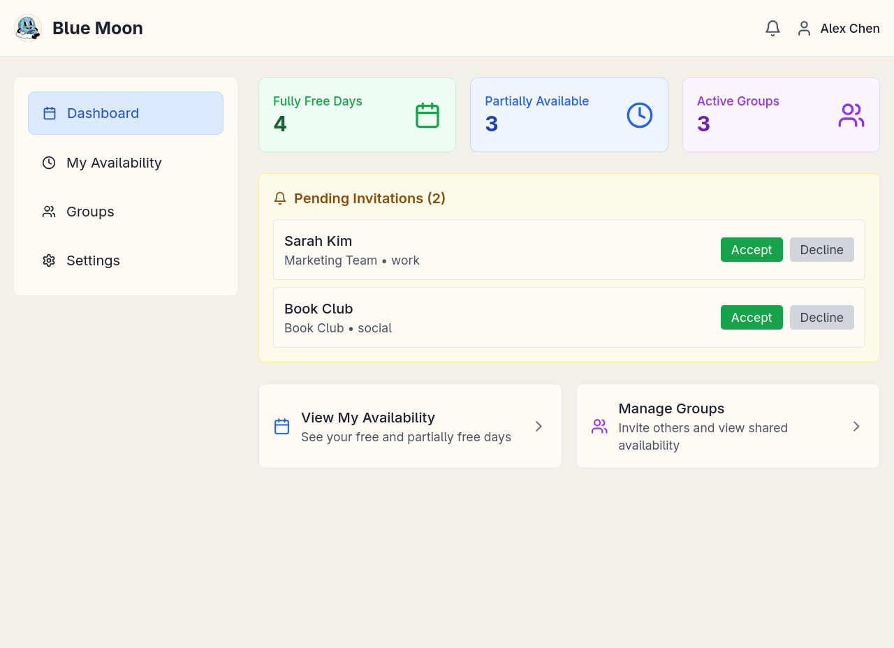
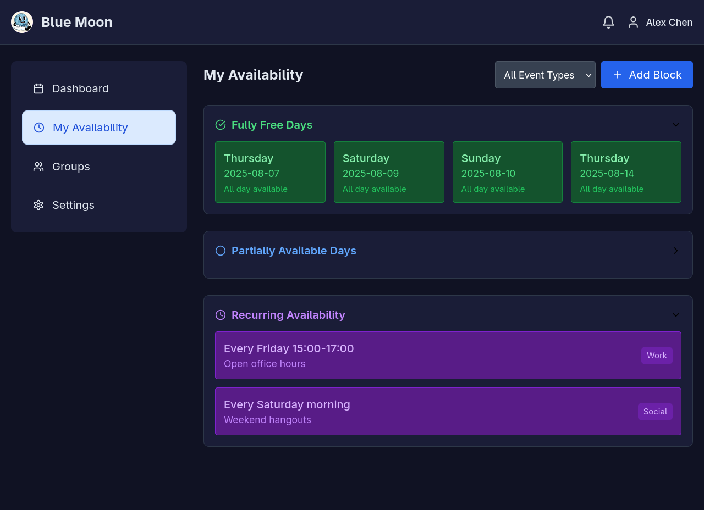

# Blue Moon Scheduler

Tired of coordination headaches? Share your full, partial, and recurring availability securely—on any device. Spend less time scheduling and Get together offline faster with Blue Moon.


A modern, responsive availability scheduling application built with React, TypeScript, and Tailwind CSS.

[](https://app.netlify.com/projects/bluemoonschedule/deploys)

## Screenshots

### Lightmode




### Darkmode





## Features

- **Dashboard**: Overview of availability statistics and quick actions
- **Availability Management**: View and manage fully free days, partially available slots, and recurring patterns
- **Group Management**: Create and manage groups for shared scheduling
- **Settings**: Customize theme, time format, working hours, and calendar integrations
- **Dark/Light Mode**: Toggle between light and dark themes
- **Responsive Design**: Works seamlessly on desktop and mobile devices

## Tech Stack

- **React 18** - Modern React with hooks
- **TypeScript** - Type-safe development
- **Tailwind CSS** - Utility-first CSS framework
- **Lucide React** - Beautiful icons
- **Vite** - Fast build tool and dev server

## Project Structure

```
src/
├── components/          # React components
│   ├── Header.tsx      # Application header
│   ├── Sidebar.tsx     # Navigation sidebar
│   ├── Dashboard.tsx   # Dashboard view
│   ├── Availability.tsx # Availability management
│   ├── Groups.tsx      # Group management
│   └── Settings.tsx    # Settings panel
├── contexts/           # React contexts
│   └── AppContext.tsx  # Global application state
├── types/              # TypeScript type definitions
│   └── index.ts        # Application types
├── utils/              # Utility functions
│   ├── theme.ts        # Theme utilities
│   └── time.ts         # Time formatting utilities
├── styles/             # Global styles
│   └── index.css       # Tailwind CSS imports
├── App.tsx             # Main application component
└── main.tsx            # Application entry point
```

## Getting Started

### Prerequisites

- Node.js (version 16 or higher)
- npm or yarn

### Installation

1. Clone the repository:
```bash
git clone <repository-url>
cd blue-moon-scheduler
```

2. Install dependencies:
```bash
npm install
```

3. Start the development server:
```bash
npm run dev
```

4. Open your browser and navigate to `http://localhost:5173`

### Available Scripts

- `npm run dev` - Start development server
- `npm run build` - Build for production
- `npm run preview` - Preview production build
- `npm run lint` - Run ESLint
- `npm run type-check` - Run TypeScript type checking

## Key Components

### AppContext
Manages global application state including:
- Active tab navigation
- Theme preferences
- User data and preferences
- Availability data
- Groups and invitations

### Theme System
Supports both light and dark themes with consistent styling across all components.

### Time Formatting
Flexible time display supporting both 12-hour and 24-hour formats.

## Contributing

1. Fork the repository
2. Create a feature branch
3. Make your changes
4. Add tests if applicable
5. Submit a pull request

## License

MIT License - see LICENSE file for details. 
